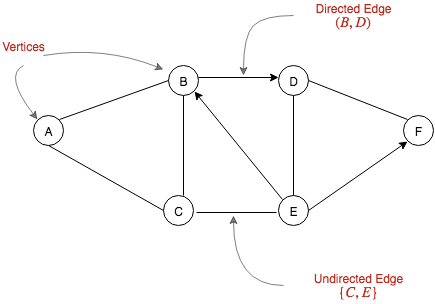
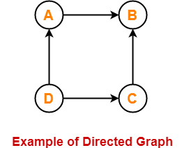
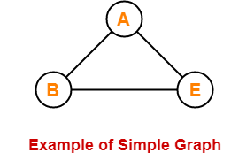
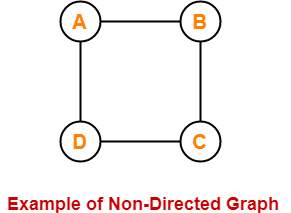
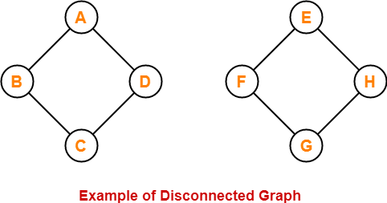
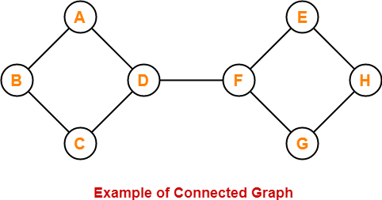
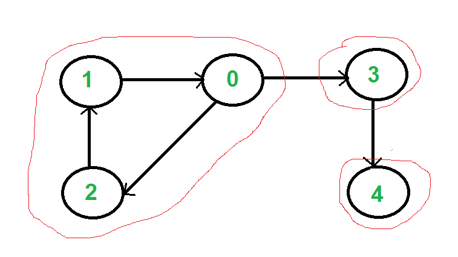
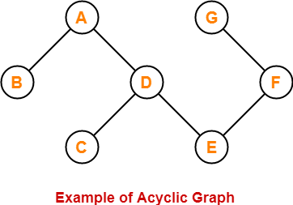

# INTRODUCTION TO GRAPHS
Graph is a data structure that consists of following two components:
1. A finite set of vertices also called as nodes.
2. A finite set of ordered pair of the form (u, v) called as edge.

Graphs are used to represent many real-life applications: Graphs are used to represent networks. The networks may include paths in a city or telephone network or circuit network.

Graph is defined as:
$$
G=(V,E)
$$
on set of vertices V, and contains a set of edges E.

# TYPES OF GRAPH

## DIRECTED GRAPH
If edge have direction then graph is called directed graph.

Self Loop : In a directed graph if there is a edge connecting itself then it is called self loop.
Parallel Edges : Pair of edges between same vertices are called paralled edges.
Indegree : Number of edges coming in to a vertex is called indegree of that vertex.
Outdegree : Number of edges coming out from a vertex is called outdegree of that vertex.

## SIMPLE GRAPH
Graph without self loop and parallel edges is called a simple graph.

## NON DIRECTED GRAPH

Graph without directed edges are called non directed graph.

Non directed graph has no indegree and outdegree , but number of edges connecting a vertex is called degree.

## NON CONNECTED GRAPH

A graph in which there does not exist any path between at least one pair of vertices is called as a disconnected graph.

## CONNECTED GRAPHS

A graph in which there exixts at least one path between every pair of vertices are called connected graph

Articulation Points : Those vertices whose removal will split graph into two diffrent components are called articulation points. For ex : vertex D and F and articulation points.

## STRONGLY CONNECTED GRAPHS

A graph in which from every vertex we can reach all other vertex in called strongly connected graphs.

Here vertex 0 , 1 , 2 forms a strongly connected graph but vertex 3 act as articulation point.
Path : It is set of vertices between a pair of vertex.

## DIRECTED ACYCLIC GRAPH
A graph not containing any cycle in it is called as an acyclic graph.

Topological Ordering: If in a directed graph we can arrange vertex such that edges only follow only one direction and they can be arranged horizontally

# TYPES OF TRAVERSAL IN GRAPHS

## BREADTH FIRST SEARCH (BFS)
[Wiki For Breadth First Search](https://en.wikipedia.org/wiki/Breadth-first_search)
 It starts at the tree root (or some arbitrary node of a graph and explores all of the neighbor nodes at the present depth prior to moving on to the nodes at the next depth level.

## DEPTH FIRST SEARCH (DFS)
[Wiki For Depth First Search](https://en.wikipedia.org/wiki/Depth-first_search)
DFS is like level order traversal in trees , where level are referred as depth.

# SPANNING TREE
[Wki For Spannig Tree](https://en.wikipedia.org/wiki/Spanning_tree)
A spanning tree T of an undirected graph G is a subgraph that is a tree which includes all of the vertices of G, with minimum possible number of edges. In general, a graph may have several spanning trees, but a graph that is not connected will not contain a spanning tree.

Necessary Conditon For Spanning Tree :
1. There should no cycle in spanning tree ( trees don't have cycles ) , but this doesn't mean that graph should not contain cycles.
2. Graph should be connected , if not connected we will get spanning trees for any one of the component of the  graph.

$$
NumberOfSpanningTree = C{{Edge}\choose{Vertex-1}} - NumberOfCycle
$$

## MINIMUM SPANNING TREE
[Wiki For Minimum spanning Tree](https://en.wikipedia.org/wiki/Minimum_spanning_tree)

### PRIM'S MINIMUM SPANNING TREE
[Program For prim's spanning tree](https://www.geeksforgeeks.org/prims-minimum-spanning-tree-mst-greedy-algo-5/)
When applied on non connected graph it will provide spanning tree for any one of the component of the graph.
$$
TimeComplexity = O(edges * (vertices-1))
			   = O(n^)
$$

### KRUSKAL'S MIMIMUM SPANNING TREE
[Program For Kruskal's spanning tree](https://www.geeksforgeeks.org/kruskals-minimum-spanning-tree-algorithm-greedy-algo-2/)
When applied on non connected graph it will provide spanning tree for any all of the component of the graph
$$
TimeComplexity = O(edges * (vertices-1))
			   = O(n^)
$$
But when we use min-heap to sort vertex then complextity reduces to nlogn .
Prim's algo focus on forming tree but kruskal's algo focus on finding minimum spanning tree and hence well suited for this problem.
